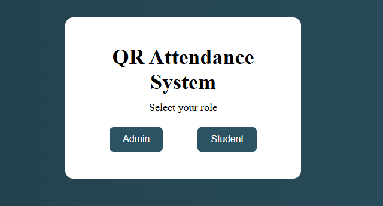
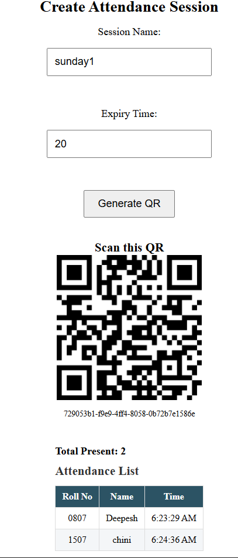
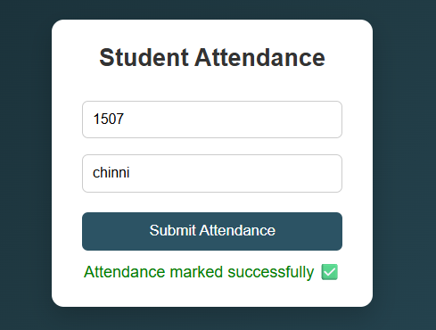

# 📌QR Attendance Management System

A full-stack QR-based Attendance Management System built using React, Spring Boot, and MySQL.

The system allows admins to generate session-based QR codes and students to mark attendance securely by scanning the QR code.

-------------------------------------------------------------------------------------------

### 

### 🚀 Live Demo

🔗 Frontend (Live App)

https://qr-attendance-eta.vercel.app/

🔗 Backend API

https://qr-attendance-backend-l6vl.onrender.com

API Base URL:
https://qr-attendance-backend-l6vl.onrender.com

-------------------------------------------------------------------------------------------

### 🏗Architecture Overview

User (Browser / Mobile)

&nbsp;       ↓

Vercel (React Frontend)

&nbsp;       ↓

Render (Spring Boot Backend API)

&nbsp;       ↓

Railway (MySQL Database)

-------------------------------------------------------------------------------------------

### 🧠 How It Works

Admin creates a session with expiry time.

Backend generates a unique token.

QR code is generated using the token.

Students scan QR via mobile camera.

Attendance is recorded if:

Session is valid

QR is not expired

Device has not already marked attendance

Admin dashboard auto-refreshes attendance list.

-------------------------------------------------------------------------------------------

### 

### ⚙ Tech Stack

**Frontend**

* React (Vite)
* Axios
* QRCode.react
* HTML5-QR Scanner
* CSS

**Backend**

* Spring Boot
* Spring Data JPA
* MySQL
* Hibernate
* CORS Configuration

**Database**

* MySQL (Railway Cloud)

**Deployment**

* Frontend → Vercel
* Backend → Koyeb
* Database → Railway
  

-------------------------------------------------------------------------------------------

### ✨ Features

Session-based QR generation

QR expiry mechanism

Device-based duplicate prevention

Auto-refresh attendance list

Live present count

Production deployment with environment variables

Secure CORS handling

Cloud-based MySQL database

--------------------------------------------------------------------------------------------

### 🔐 Security Logic

QR token linked to session

Expiry time validation

Device ID stored per attendance record

Duplicate attendance blocked (device + session check)

Backend-side validation (cannot bypass frontend)

--------------------------------------------------------------------------------------------

### 📦 API Endpoints

**Create Session:**

POST /api/session/create

**Mark Attendance:**

POST /api/attendance/mark

**Fetch Attendance:**

GET /api/attendance/session/{sessionId}

--------------------------------------------------------------------------------------------

### 🛠 Local Setup Guide

#### Backend

**Clone repo:**

git clone https://github.com/gallaDeepesh/qr-attendance-backend

Add in application.properties:

spring.datasource.url=jdbc:mysql://localhost:3306/qr\_attendance

spring.datasource.username=root

spring.datasource.password=yourpassword

server.port=8080

**Run:**

mvn spring-boot:run

#### Frontend

**Clone repo:**

git clone https://github.com/gallaDeepesh/qr-attendance-frontend

**Create .env file:**

VITE\_API\_URL=http://localhost:8080

**Run:**

npm install

npm run dev

--------------------------------------------------------------------------------------------

### 🌍 Deployment Details

##### **Frontend deployed on:**

https://qr-attendance-eta.vercel.app/

##### Backend deployed on:

https://depressed-bill-1codevibe-655091d5.koyeb.app

Database hosted on Railway (MySQL Cloud)

Environment variables used for production safety.
--------------------------------------------------------------------------------------------

📸 Screenshots

---
## 📸 Screenshots

### Home Page

### Admin page

### Student Page
